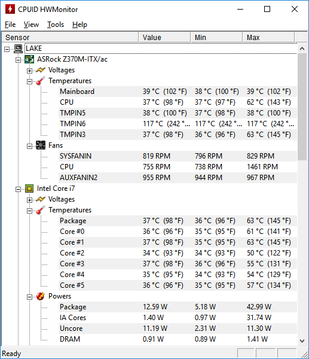

# Chocolatey package for HWMonitor

## What is HWMonitor

[HWMonitor] is a simple application written by [CPUID] that shows key statistics on how your system is working including:

- Temperature sensors on motherboards, CPUs, SSDs, and GPUs
- Voltage and power consumption of individual components
- Fan speeds

## Using this Package

[Chocolatey] makes it easy to install and upgrade many apps. 

Please check out the [Chocolatey Package Page] for more info on how to install or upgrade HWMonitor with Chocolatey.

[Chocolatey]: https://chocolatey.org/
[Chocolatey Package Page]: https://chocolatey.org/packages/hwmonitor
[CPUID]: https://www.cpuid.com/
[HWMonitor]: https://www.cpuid.com/softwares/hwmonitor.html